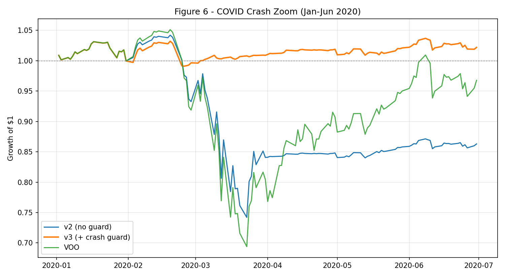

# When Does Risk-Managed Momentum Add Value?

*A reproducible, out-of-sample, regime-conditional study of a volatility-targeted dual-momentum strategy.*

[](https://colab.research.google.com/github/aarivgoyal/quant-momentum-risk-targeting/blob/main/colab_run.ipynb)
[](https://doi.org/10.5281/zenodo.21444647)
<!-- After recording the walkthrough: **▶ [3-minute video walkthrough](YOUR_VIDEO_LINK)** -->

An out-of-sample, walk-forward, bootstrap-tested study of when risk-managed momentum protects a portfolio. It cushions slow bear markets, and once an engineered fix is added it sharply reduces fast-crash losses — but it reveals a fundamental crash-protection-versus-whipsaw tradeoff. The contribution is methodological: a financial idea specified mathematically, implemented without common backtest errors, diagnosed where it fails, and reported honestly enough to show exactly where it works and where it does not.

> This project is for educational research only and is not investment advice.

**Research question:** When does risk-managed allocation add value, and can we distinguish that value from luck? A defensive strategy is *expected* to trail equities in a sustained bull market, so the scientific question is conditional, not "did it beat the market?"

## Key findings

- **Honest benchmarking.** Over a 13-year bull market (Feb 2013 – Jun 2026) the strategy reduces volatility (12.4% vs 17.0%) and drawdown vs buy-and-hold, but does not beat a simple 60/40 on a risk-adjusted basis — and no setting in a 36-configuration grid does either. Reported as a structural result, not hidden.
- **Regime-conditional value.** It outperformed both benchmarks in the slow 2022 bear (−14.2% vs −24.1% and −20.2%) but suffered its worst loss in the fast COVID crash, because the signal is monthly.
- **An engineered fix.** A daily crash-guard overlay sharply reduced fast-crash losses: in the COVID crash it improved the crisis return from −28.5% to −1.9% while cutting max drawdown from −28.8% to −4.0% (the 2018 selloff improved similarly, from −13.3% to −1.6% return and −13.7% to −3.0% drawdown), with statistically significant downside protection vs both benchmarks in down markets.
- **The overfitting trap, shown empirically.** Walk-forward re-optimization produced worse out-of-sample results than fixed parameters (Sharpe 0.33 vs 0.58) — a clean demonstration of why chasing the best in-sample fit backfires.
- **The deeper result.** Crash protection and whipsaw are two ends of one speed dial; reacting faster to crashes is inseparable from whipsawing more in calm markets.

## Strategy and data

A rules-based, monthly-rebalanced strategy over four ETFs — VOO (U.S. equities), VXUS (international equities), BND (aggregate bonds), and SHY (short-term Treasuries, the cash-like sleeve) — with BIL supplying a real, time-varying risk-free rate. Each month, absolute momentum decides risk-on vs risk-off, relative momentum picks the strongest risk asset, and volatility targeting sizes the position toward a 10% annual-volatility target. The backtest corrects the usual retail mistakes: signals are applied with a one-day delay (no lookahead), costs are charged on turnover, and risk-adjusted metrics use the real risk-free rate. It is validated five ways — in/out-of-sample split, walk-forward parameter selection, regime-conditional crisis windows, a 36-cell sensitivity grid, and a block-bootstrap significance test.

## Results at a glance

Full sample, Feb 2013 – Jun 2026, $10,000 start. *(Reproduced from `quant_momentum_ALL_IN_ONE.py`.)*

| Portfolio | CAGR | Ann. Vol | Sharpe | Max DD | Final |
|---|---|---|---|---|---|
| **Risk-targeted strategy** | 8.30% | 12.4% | 0.58 | −28.8% | $29,299 |
| Buy & Hold VOO | 14.75% | 17.0% | 0.81 | −34.0% | $63,539 |
| 60/40 (monthly) | 9.84% | 10.6% | 0.79 | −22.0% | $35,231 |

**Main finding:** the strategy reduced volatility and drawdown versus pure equity, but did not beat a simple 60/40 portfolio on full-sample risk-adjusted performance. Its value is regime-conditional — it helps more in slower bear markets, fails in very fast crashes, and the daily crash guard improves crash protection at the cost of whipsaw drag.

## Headline figure



*The daily crash guard (orange) sidesteps almost the entire COVID drawdown that the monthly strategy (blue) and the market (green) take.*

## Interactive version

Explore the strategy in the browser — switch configurations and watch the equity curve, drawdowns, and crisis tables update: **[live demo (GitHub Pages)](https://aarivgoyal.github.io/quant-momentum-risk-targeting/)** *(self-contained `index.html`, no build step).*

## How to reproduce

Every table and figure is reproducible from the cached data and a fixed random seed (42), with no live data download required.

1. Open `quant_momentum_ALL_IN_ONE.py` in Google Colab (badge above) or run locally.
2. Make sure `prices_cache.csv` and `rf_cache.csv` are in the working directory.
3. Run it top to bottom. It regenerates every result in the paper, saving all seven figures into `figures/`.

```bash
pip install -r requirements.txt
python quant_momentum_ALL_IN_ONE.py
```

See [`REPRODUCIBILITY.md`](REPRODUCIBILITY.md) for the full environment, data notes, and a figure/table map.

## Limitations

A backtest describes the past, not the future. The four-ETF universe aids interpretability but limits diversification; the sample window is short by historical standards; turnover-based costs are modeled but taxes, slippage, and market impact are not; and the crash guard was designed *after* diagnosing the COVID failure, so it should be read as an engineered extension, not proof of future crash avoidance. The monthly signal latency is both a deliberate design choice and the direct cause of the fast-crash weakness.

## What I learned

I started thinking the goal was to build a strategy that beats the market. The real work was learning to ask a sharper question: not "does it win?" but "when does it add value, and can I tell that value from luck?" Answering it honestly meant correcting my own bugs, testing out-of-sample, running significance tests that many backtests quietly skip, diagnosing exactly why the strategy failed in the COVID crash, and engineering a fix — only to discover that the fix exposed a deeper tradeoff. That shift, from treating markets as a domain of instinct to treating them as systems that can be modeled, stress-tested, fixed, and falsified, is what I want to keep doing.

## Contents

- `quant_momentum_ALL_IN_ONE.py` — single runnable script that reproduces everything
- `prices_cache.csv`, `rf_cache.csv` — pinned data (2012–2026) for exact reproducibility
- `figures/` — fig1 through fig7 (generated by the script)
- `paper/Quant_Momentum_Strategy.pdf` — the full research paper
- `poster/Quant_Momentum_Poster.pdf` — the research poster
- `index.html` — interactive backtest webpage (served via GitHub Pages)
- `colab_run.ipynb` — one-click Colab runner
- `PROJECT_SUMMARY.md`, `REPRODUCIBILITY.md` — plain-English summary and reproduction guide
- `requirements.txt`, `LICENSE`, `CITATION.cff`

## Full paper

The complete write-up is in [`paper/Quant_Momentum_Strategy.pdf`](paper/Quant_Momentum_Strategy.pdf).

## Citation

If you reference this work, please cite it using the "Cite this repository" button above (generated from CITATION.cff), or the archived version on Zenodo: https://doi.org/10.5281/zenodo.21444647

## Author

Aariv Goyal. Independent research project, 2026.

## License

Code is released under the MIT License (see `LICENSE`). The research paper is shared for reading and citation.
